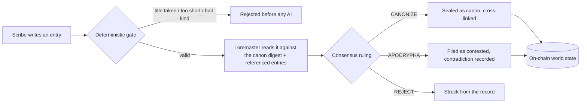

<div align="center">

# Palimpsest

**A shared fictional world, written by many hands and held consistent by an AI Loremaster that runs as a GenLayer Intelligent Contract.**

[](https://abstrusimad.github.io/palimpsest/)
[](https://explorer-bradbury.genlayer.com/address/0xBf42a47665B32180De8d8977f8A9439e919860B9)
[](#run-it-locally)
[](contracts/contract.py)

</div>

---

**Live** &middot; [abstrusimad.github.io/palimpsest](https://abstrusimad.github.io/palimpsest/)  
**Loremaster contract** &middot; `0xBf42a47665B32180De8d8977f8A9439e919860B9` &middot; [view on the Bradbury explorer](https://explorer-bradbury.genlayer.com/address/0xBf42a47665B32180De8d8977f8A9439e919860B9)  
**First sealed in transaction** &middot; `0x72278c99cb6a063e8037b6a0e1183b84364825e3492217ffbffb6271a45cb405`

Submit a fragment of lore. If it does not contradict what is already canon, it is sealed on chain and cross-linked into the world. If it does contradict, it is kept apart as apocrypha. If it is incoherent, it is struck. The judge is not a server with a delete key, it is a verdict that a network of validators has to agree on before it is written.

## At a glance

| | |
| --- | --- |
| What it is | A multi-page, collaborative worldbuilding encyclopedia |
| The decision | Does a new entry stay consistent with the whole canon |
| Settled by | GenLayer validator consensus, no central moderator |
| Entry kinds | Figure, Place, Age, Artifact, Event |
| Rulings | `CANONIZE`, `APOCRYPHA`, `REJECT` |
| Frontend | Next.js 14 static export, eight routes, no backend |
| Cost to write | A Bradbury network fee, mostly refunded; no deposit |

## How a page enters the canon



The model proposes a ruling; the chain disposes. A leader drafts the verdict, every validator re-runs the same judgement, and the network keeps the result only when they converge on the ruling and on the consistency score within a set tolerance. Deterministic code then does the irreversible part: it admits canon, files apocrypha, refuses duplicate titles, and records the cross-links. The prompt persuades. The code enforces.

## Contract API

`contracts/contract.py`, class `Palimpsest`.

| Method | Type | Purpose |
| --- | --- | --- |
| `scribe(title, kind, body, refs)` | write, consensus | The one write that needs agreement: weigh an entry and rule on it |
| `get_stats()` | view | Canon, apocrypha, and total submissions weighed |
| `get_entries(start)` | view | A page of entries, twenty at a time |
| `get_entry(id)` | view | One entry in full: body, seal, score, cross-links, note |
| `get_chronicle(start)` | view | The record of judgement, newest first |

## The application

A static single page would not do the world justice, so the frontend is eight real routes under one illuminated shell.

| Route | Room |
| --- | --- |
| `/` | Frontispiece and the state of the canon |
| `/codex` | The library of canon entries, filterable by kind |
| `/entry?id=` | A single leaf, read in full with its cross-links |
| `/scribe` | The scriptorium, where you submit and watch consensus settle |
| `/canon-map` | The cross-links drawn as a living constellation |
| `/apocrypha` | The contested leaves and what they broke against |
| `/chronicle` | Every ruling, canonization to struck |
| `/loremaster` | How the keeper works and why it can be trusted |

## Run it locally

```bash
# 1. validate and prove the ruling under real consensus
genvm-lint lint contracts/contract.py
gltest tests/integration/ -v -s --network studionet

# 2. deploy to Bradbury, then wire the address into the frontend
genlayer deploy --contract contracts/contract.py
#    set CONTRACT_ADDRESS and DEPLOY_TX in frontend/src/lib/contract.ts

# 3. build the static site
cd frontend && npm install && npm run build   # output in ./out
```

## Repository map

```
palimpsest/
  contracts/contract.py        the Loremaster, GenVM Python
  tests/integration/           the StudioNet consensus test
  frontend/
    src/app/                   the eight routes + layout + globals
    src/components/            PageHeader, ConsensusTheater, graph, toasts
    src/lib/                   genlayer-js plumbing, formatters
    public/art/                the illuminated plates
  scripts/no-emoji.js          ship gate
```

<div align="center"><sub>Built on GenLayer. Lettered in IM Fell English and EB Garamond. No deposit is ever taken; a scribe pays only the network fee.</sub></div>
